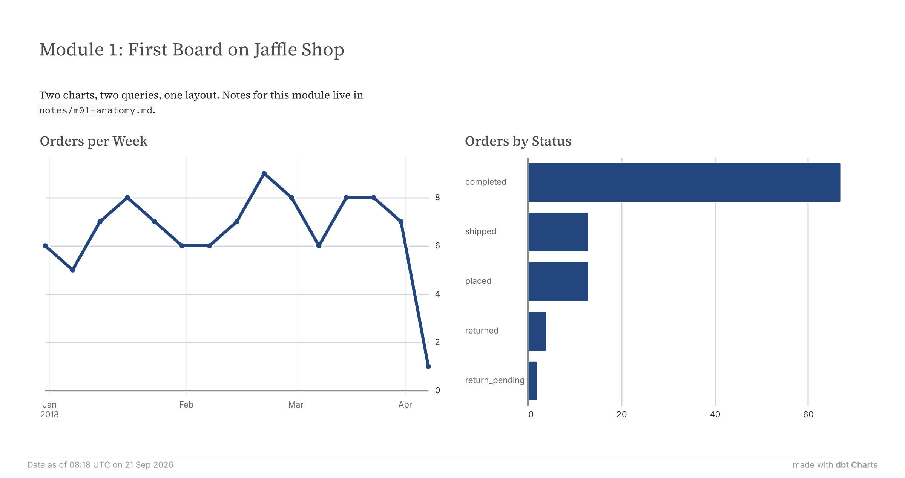

_Written against dct 0.8.0. The syntax changes before 1.0, so check the version before copying code._

**What is this series?** I am learning dbt Charts and writing it up as I go. Each post is backed by a working board you can clone and run.

**Who this is for:** you use dbt, you build dashboards somewhere else, and you are curious whether this is worth your time. I assume SQL and dbt. I explain YAML only where dbt Charts does something unusual with it.



What dbt Charts is
------------------

It is dbt Labs' open-source language for dashboards. You write a board as a YAML file. The tool turns it into charts and renders them as a web page, PNG, SVG, or a PDF. The package is `dbt-charts` and the command is `dct`.

One rule explains most of the design:

> _The query decides what data appears. The chart decides how it looks. Aggregation belongs to the query._

Want orders counted by week? You write `COUNT(*)` and `GROUP BY` yourself. There are no calculated fields in the chart layer. Every number on the canvas comes from a line of SQL you can point at. Three chart features do compute — `histogram` binning, `style.stack: normalize`, and `aggregate:` inside a `support_table:` — and each one you have to write down by name.

**If you come from Tableau,** dropping a measure onto a shelf aggregates it for you, and a mark's grain depends on what else is on the shelves. Here the grain is fixed in SQL, and the chart cannot change it behind you.

Getting started
---------------

The lab runs on dbt's jaffle shop — a fictional sandwich shop with 100 customers and 99 orders, running from 1 January to 9 April 2018. Small enough to check by hand, which is the point early on.

```bash
git clone https://github.com/imagineazhar/dbt-charts-learning.git
cd dbt-charts-learning
git checkout p1
./setup.sh
```

The script installs pinned versions of everything, builds the sample data locally, and wires up the boards. Pinning matters: it means your charts show the same numbers as mine.

Then start the preview server:

```bash
source .venv/bin/activate
cd lab/jaffle_shop && dct serve
```

Open the URL it prints and go to `/lessons/m01_first_board/`.

Windows setup and fixes for the usual problems live in the repo, in the README, and `TROUBLESHOOTING.md`. I have kept them out of the post so this stays about charts.

If you would rather look before installing anything, [play.dbtcharts.com](https://play.dbtcharts.com/) runs boards in the browser. You can use its built-in AI to create dummy data to practice on. I would recommend this.

What a board is
---------------

A board is one YAML file that renders as one page. It holds four kinds of thing:

- `queries:` — named SQL, one result set each
- `charts:` — named charts, each reading one query
- a layout — exactly one of `rows:`, `cols:`, `grid:` or `tabs:`
- optional extras — `title:`, `variables:`, `theme:`, `style:`

Boards live in `charts/` inside your dbt project. A file called `dbt_charts.yml` at the project root anchors everything: it holds the `sources:` registry, which is the set of named connections a board is allowed to read from, and `dct` walks up from wherever you run it to find that file. Drop a new `.yml` under `charts/` and `dct serve` picks it up.

Unknown keys are errors, not warnings, and there is no escape hatch to raw Vega-Lite — `encoding`, `mark`, `spec` and `transform` are rejected at compile time. Every board is fully typed. That is the property the rest of this series is about.

Where it sits in your pipeline
------------------------------

Downstream of dbt, in the slot a BI tool normally occupies:

```text
dbt build          models in the warehouse, plus the manifest
      |
board YAML         {{ ref('orders') }}
      |
dct validate       schema and refs checked against the dbt manifest
      |            (no database connection needed)
dct render         SQL runs against the source
      |            board compiles to Vega-Lite
HTML · PNG · SVG · PDF
```

dct does not model, transform or materialise anything — that stays in dbt. What it replaces is the dashboard layer on top.

The seam between the two is `{{ ref('orders') }}`, the dbt reference you already write. A board points at a model, not a table, so validation can check it against dbt's manifest before touching a database. Rename the model and you get this:

```text
ERR-DBT-REF-UNKNOWN-NODE  SQL references {{ ref('ordersss') }}, but no model,
seed, or snapshot named 'ordersss' exists in the dbt manifest. Available:
customers, orders, raw_customers, raw_orders, raw_payments, stg_customers,
stg_orders, stg_payments.
Hint: Did you mean 'orders'?
```

Loud, and before anything runs.

Creating your first chart
-------------------------

The smallest thing that works is one query, one chart, one row:

```yaml
title: "Orders per week"

queries:
  orders_by_week:
    sql: |
      SELECT date_trunc('week', order_date) AS week,
             COUNT(*) AS orders
      FROM {{ ref('orders') }}
      GROUP BY 1
      ORDER BY 1
    source: jaffle

charts:
  weekly_orders:
    query: orders_by_week
    type: line
    x: week
    y: orders

rows:
  - weekly_orders
```

Save that as `charts/first.yml` and check it:

```bash
dct validate charts/first.yml
```

Validation needs no database. It checks the schema, every chart-to-query reference, and every `ref()` against the dbt manifest. Then run `dct serve` and reload the page.

`source: jaffle` names a connection from `dbt_charts.yml`. You can delete that line and let the query inherit the default from `charts/meta.yml`, where `setup.sh` already put `source: jaffle` for the whole directory.

Add each new chart only once the previous one validates. That is dct's own advice in `dct docs getting-started`, and it holds up.

What's on a chart
-----------------

A chart is a binding: one query, one type, and columns mapped to channels.

| Field | What it does |
| --- | --- |
| `query` | Which named query supplies the rows. Required. |
| `type` | One of 16 — `line`, `bar`, `area`, `scatter`, `pie`, `kpi`, `table`, `histogram`, `heatmap` and the rest. |
| `x`, `y` | Column names. `y` takes a list for multi-series. |
| `color` | A bare column name; its values split the data into series. |
| `title`, `subtitle` | Text above the chart. |
| `x_label`, `y_label`, `sort`, `height` | Axis titles, ordering, exact pixel height. |
| `style` | Typed paint — number formats, orientation, stacking, aspect ratio. Not raw CSS. |

Two things to hold on to. Every channel takes a **column name**, never an expression: if a value needs changing, change the SQL. And colours are palette tokens the theme resolves, not hex codes, so a board restyles itself when you switch theme.

Fields a type does not own are rejected — `theta` on a bar chart, `x` on a pie.

Add a second chart and a layout, and you have the board this post ships:

```yaml
title: "Module 1: first board on jaffle shop"

queries:
  orders_by_week:
    sql: |
      SELECT date_trunc('week', order_date) AS week,
             COUNT(*) AS orders
      FROM {{ ref('orders') }}
      GROUP BY 1
      ORDER BY 1
    source: jaffle

  orders_by_status:
    sql: |
      SELECT status, COUNT(*) AS orders
      FROM {{ ref('orders') }}
      GROUP BY 1
      ORDER BY 2 DESC
    source: jaffle

charts:
  weekly_orders:
    query: orders_by_week
    type: line
    title: "Orders per week"
    x: week
    y: orders

  status_mix:
    query: orders_by_status
    type: bar
    title: "Orders by status"
    x: status
    y: orders

rows:
  - text: |
      Two charts, two queries, one layout.
  - cols:
      - weekly_orders
      - status_mix
```

`rows:` stacks items vertically; a `cols:` block sits them side by side. Charts appear by name, so layout stays pure arrangement and never hides chart settings. A `text:` block is the one exception, and it is worth knowing what it is: published Markdown, not a code comment. Whatever you write there lands on the page, in the PNG and in the PDF.

Rendering boards and charts
---------------------------

Two ways. `dct serve` is the live preview you edit against. `dct render` writes a file:

```bash
dct render charts/first.yml --format png
dct render charts/first.yml --format pdf --output reports/orders.pdf
dct render charts/*.yml --format svg --output renders/{stem}.svg
```

Formats are `svg`, `html`, `png`, `pdf` — and `terminal`, which draws the board as ASCII without leaving the shell (the bar chart prints below the line chart, trimmed here):

```text
============================================================
 Module 1: first board on jaffle shop
============================================================

                    Orders per week
   ┌───────────────────────────────────────────────┐
9.0┤                          •                    │
7.7┤       •••••••         ••• ••••     ••••••••   │
6.3┤•••••••       •••••••••        •••••       •   │
3.7┤                                            •  │
2.3┤                                             • │
1.0┤                                              •│
   └───┬─────────────────────────────┬─────────────┘
   2018-01-15 00:00:00   2018-03-19 00:00:00
```

The PNG at the top of this post came from the same command with `--format png`.

One wrinkle specific to this lab: `setup.sh` links `boards/` into the project as `charts/lessons/`, and `dct render` resolves that link, finds the real file outside the project, and refuses. Pipe the board in instead:

```bash
cat ../../boards/m01_first_board.yml \
  | dct render - --format png --output ../../assets/renders/m01_first_board.png
```

`dct validate` and `dct serve` both follow the link without complaint; only `render` minds. `TROUBLESHOOTING.md` has the detail.

What's next in the series
-------------------------

Ten more posts, each with a board in the repo:

- **P2 — Sixteen chart types, and the shapes that aren't types.** Why asking for a bullet chart returns an error instead of a chart.
- **P3 — Layout:** rows, cols, tabs and grid, and what the layout tree cannot express.
- **P4 — Filters you can read:** variables wired into SQL.
- **P5 — Encoding a house style** in `meta.yml`.
- **P6 — Layers, small multiples,** and the first chart I could not build.
- **P7 — Drill-down** without a BI tool.
- **P8 — Reviewing a dashboard in a pull request.**
- **P9 —** I asked an agent to build the same board.
- **P10 — Shipping boards:** PNG, SVG, PDF, MkDocs.
- **P11 —** From decision brief to board.

The board from this post is in [the repo](https://github.com/imagineazhar/dbt-charts-learning), tagged `p1`.
