_Written against dct 0.8.0. The syntax changes before 1.0, so check the version before copying code._

Post 1 gave you a line and a bar. A real dashboard needs different types of charts. This post builds nine, one at a time: bar, pie, donut, line, area, scatter, histogram, KPI and table.

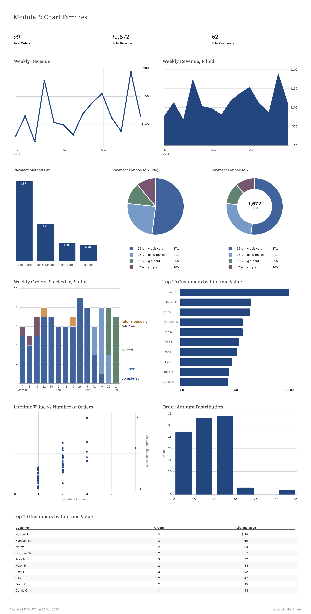

This is what one row of the query has to be:

| Chart | One row of the query is |
| --- | --- |
| Bar | one bar |
| Pie | one slice |
| Donut | one slice |
| Line | one point |
| Area | one point |
| Scatter | one dot |
| Histogram | one raw record, which dct bins for you |
| KPI | the only row: exactly one |
| Table | one table row |

Each section starts with the query, then the chart.

dct has 16 authorable types. These nine cover most of what a first dashboard needs. Maps, layers and small multiples come later in the series.

## Bar: one number per category

```yaml
queries:
  payment_mix:
    sql: |
      SELECT payment_method, SUM(amount) AS total_amount
      FROM {{ ref('stg_payments') }}
      GROUP BY 1
      ORDER BY 2 DESC
    source: jaffle

charts:
  payment_bar:
    query: payment_mix
    type: bar
    title: "Payment method mix"
    x: payment_method
    y: total_amount
```

One row per bar. `x` is the category, `y` is the number. That is the whole chart. Here is what it draws:

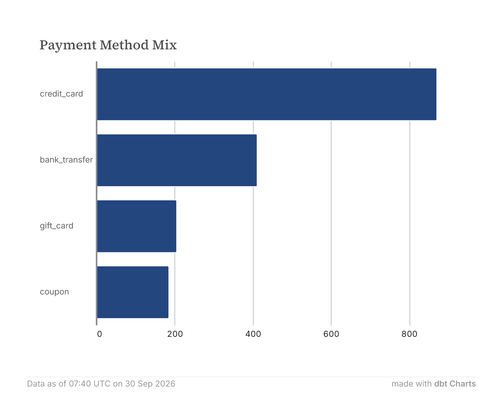

I did not say orientation, a bar with a text category on `x` is horizontal by default. The value axis runs along the bottom.

### Turn it into vertical bar chart

I want columns, so I say so. Add one key under the chart:

```yaml
    style:
      orientation: vertical
```

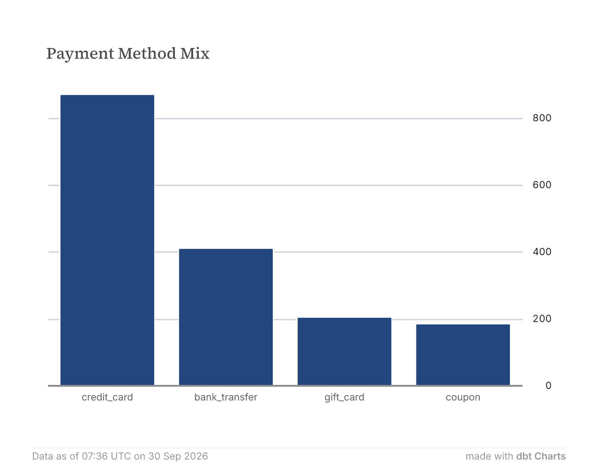

The category is still `x` and the number is still `y`. Only the direction changed. dct also moved the value axis to the right and drew gridlines. Those are defaults, and the next step removes them.

### Remove the axis, label the bars

If the bars carry their own numbers, the value axis is redundant. Three additions under `style:` do it:

```yaml
    style:
      orientation: vertical
      number_format: currency_whole
      axis_y:
        title:  { visible: false }
        labels: { visible: false }
        ticks:  { visible: false }
        line:   { visible: false }
        grid:   { visible: false }
      marks:
        bar:
          labels:
            visible: true
```

`number_format: currency_whole` formats every number on the chart as whole dollars.

There is no single switch for the axis. It has five parts and you hide each one. `axis_y` always means the measure axis, whichever way the bars point.

`marks.bar.labels.visible: true` prints each value on its bar. The labels default to white text inside the top of the bar and pick up `number_format`, so they read `$871`.

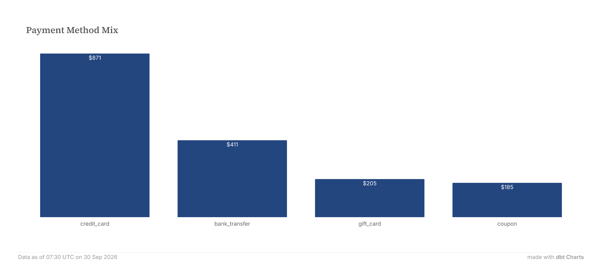

### Turn it sideways on purpose

A ranking is where horizontal earns its place: the names get room. This chart needs a new query, one row per customer, ten rows:

```yaml
queries:
  top_customers:
    sql: |
      SELECT first_name || ' ' || last_name AS customer,
             number_of_orders,
             customer_lifetime_value
      FROM {{ ref('customers') }}
      WHERE customer_lifetime_value IS NOT NULL
      ORDER BY customer_lifetime_value DESC
      LIMIT 10
    source: jaffle

charts:
  top_customers_bar:
    query: top_customers
    type: bar
    title: "Top 10 customers by lifetime value"
    x: customer
    y: customer_lifetime_value
    style:
      orientation: horizontal
      number_format: currency_whole
```

`x` and `y` are unchanged: the category, then the number. `orientation: horizontal` makes the intent visible to the next person reading the file.

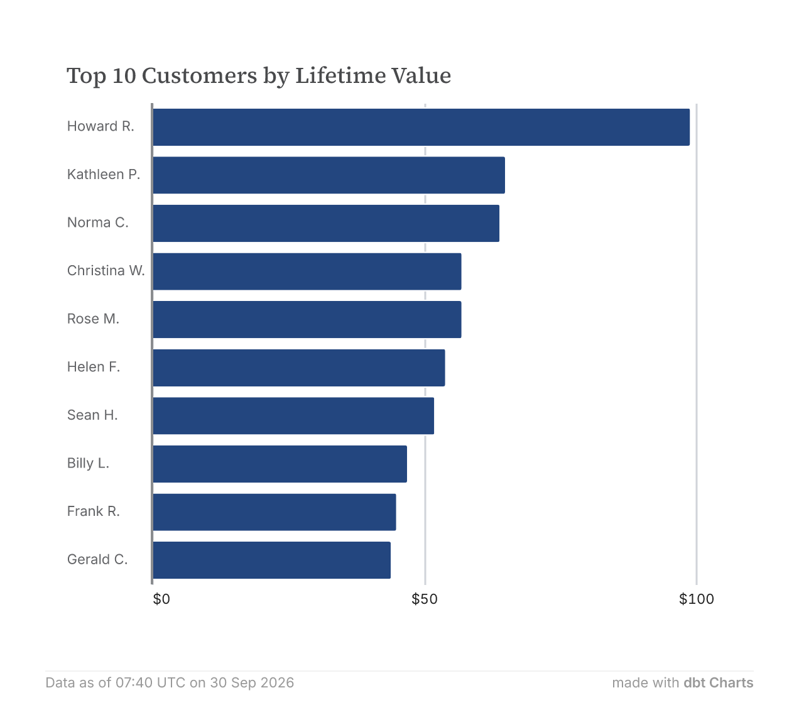

The largest customer is at the top because the query says `ORDER BY ... DESC`. The chart draws rows in the order it receives them. The value axis, `axis_y`, is drawn along the bottom and reads `$0`, `$50`, `$100` because of `number_format`.

### Stack the bars

Orientation was one key that changed how a bar looks. `stack` is another. Add a `color:` column and the docs say dct draws the groups side by side. Set `style.stack: zero` and they stack:

```yaml
  weekly_status_stacked:
    query: orders_by_week_status   # week, status, orders
    type: bar
    x: week
    y: orders
    color: status
    style:
      stack: zero
```

The query returns one row per week and status. `color` splits the bars by status. `stack: zero` piles them up from zero.

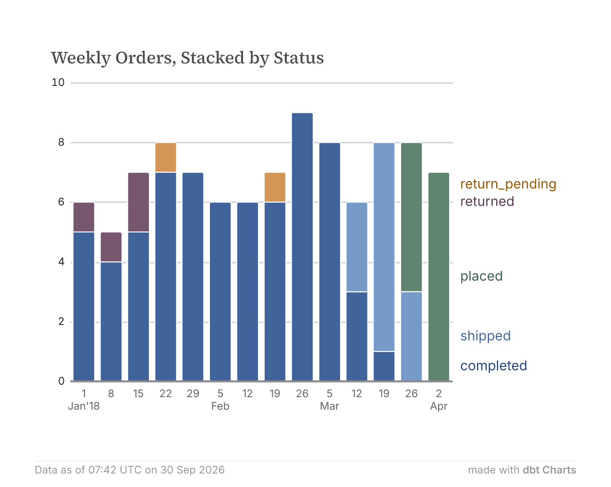

dct labels the colours at the right edge instead of drawing a legend box (not the best choice as it reads as an axis).

This is the point of the section. "Stacked bar" and "horizontal bar" are not chart types. They are `bar` with different `style:` keys.

## Pie: shares of a whole

```yaml
  payment_pie:
    query: payment_mix
    type: pie
    title: "Payment method mix (pie)"
    theta: total_amount
    color: payment_method
```

Same query as the bar, one row per slice. A pie swaps `x` and `y` for `theta`, the angle each slice takes, and `color`, which names the slices.

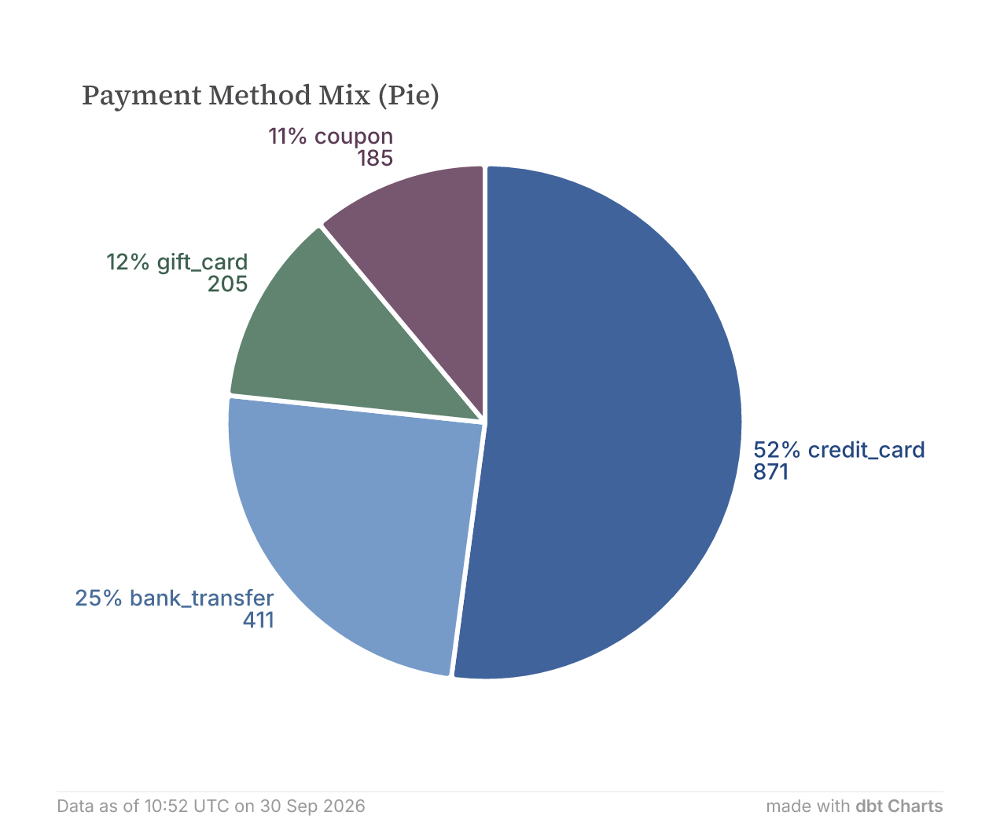

I set no labels. Each slice still reads percentage, name and value.

## Donut: a pie with a hole

To turn the pie into a donut, add one key:

```yaml
    style:
      inner_radius: 0.6
```

`inner_radius` is the size of the hole as a share of the pie's radius. The docs give a range of 0 to 1, where 0 is a solid pie. I only tried 0.6.

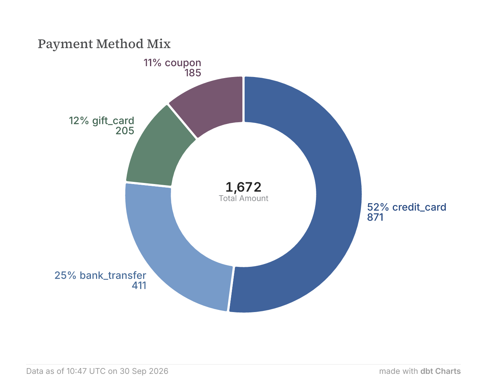

Two things happened. The hole opened, and a number appeared in it: the sum of `total_amount`, labelled Total Amount after the column. I asked for neither.

`type: donut` is a shorthand for the same thing. I rendered a `type: pie` with `inner_radius: 0.6` and a bare `type: donut`, and the two SVGs matched apart from the render time. Write it whichever way reads better.

The label is the part you are most likely to change, and `total:` does that:

```yaml
    total:
      label: Total
```

Here is the finished donut:

```yaml
  payment_donut:
    query: payment_mix
    type: donut
    title: "Payment method mix"
    theta: total_amount
    color: payment_method
    total:
      label: Total
```

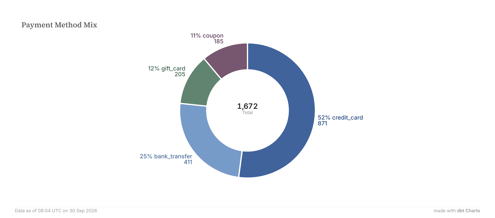

That donut took eight lines of chart YAML. The percentages, the slice labels and the centred total came free. Not every chart type is that generous, and the differences are the useful part.

## Line: one number over time

```yaml
queries:
  revenue_by_week:
    sql: |
      SELECT date_trunc('week', order_date) AS week,
             SUM(amount) AS revenue
      FROM {{ ref('orders') }}
      WHERE order_date < (SELECT date_trunc('week', MAX(order_date)) FROM {{ ref('orders') }})
      GROUP BY 1
      ORDER BY 1
    source: jaffle

charts:
  revenue_line:
    query: revenue_by_week
    type: line
    title: "Weekly revenue"
    x: week
    y: revenue
    style:
      number_format: currency_whole
```

One row per point. `x` is the date and `y` is the number, exactly as on a bar, with dates in place of categories.

The `WHERE` line drops the final week. The data stops part-way through it, so it holds only a fraction of a week's orders. Dropping it in the SQL keeps the fix where a reviewer can see it and disagree.

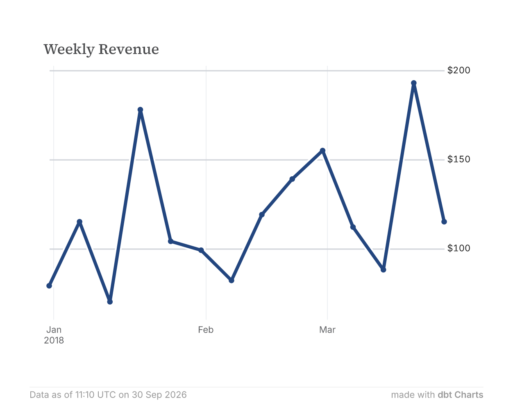

Look at the value axis. Its lowest label is $100, and there is no $0. The axis does not start at zero. Nothing in the YAML says so. dct chose the range to fit the data.

## Area: the same line, filled

Change one word:

```yaml
  revenue_area:
    query: revenue_by_week
    type: area
    title: "Weekly revenue, filled"
    x: week
    y: revenue
    style:
      number_format: currency_whole
```

Same query, same `x` and `y`.

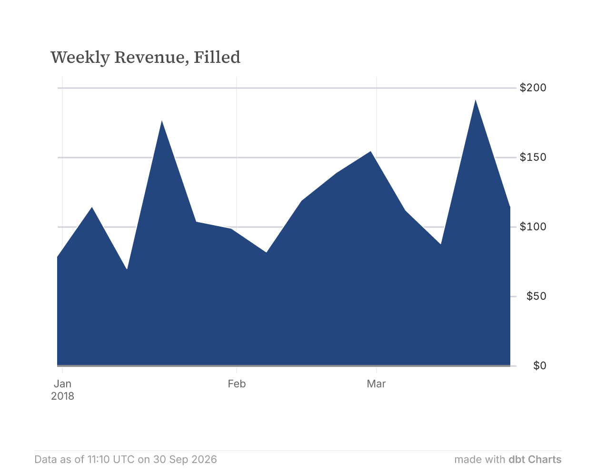

The axis now starts at $0. The line's did not. On the line your eye follows the swings. On the area it reads the height of the whole shape, so a zero baseline matters. Choose by the question you are answering.

## Scatter: two measures, one dot per row

```yaml
queries:
  customer_value:
    sql: |
      SELECT number_of_orders, customer_lifetime_value
      FROM {{ ref('customers') }}
      WHERE customer_lifetime_value IS NOT NULL
    source: jaffle

charts:
  clv_scatter:
    query: customer_value
    type: scatter
    title: "Lifetime value vs number of orders"
    x: number_of_orders
    y: customer_lifetime_value
    style:
      number_format: currency_whole
```

The query returns one row per customer, not a summary. Scatter is the first chart here that wants row-level data.

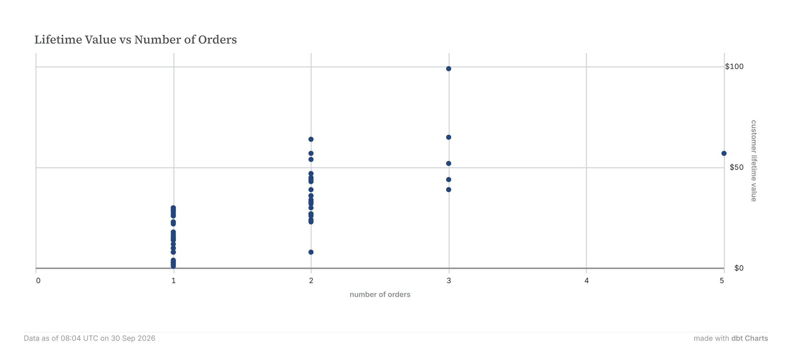

Order count is a whole number, so the dots line up in columns and the chart reads more like a strip plot. It is still worth having: the single dot at three orders and $99 stands apart. The docs list `color:` and `size:` for a third and fourth variable. Untested here.

## Histogram: one column, no aggregation

```yaml
queries:
  order_amounts:
    sql: |
      SELECT amount
      FROM {{ ref('orders') }}
      WHERE amount IS NOT NULL
    source: jaffle

charts:
  amount_histogram:
    query: order_amounts
    type: histogram
    title: "Order amount distribution"
    x: amount
```

This is the odd one. The query returns raw rows, one per order, and the chart does the binning. There is no `y`-axis. dct chose ten-dollar bins and counted them.

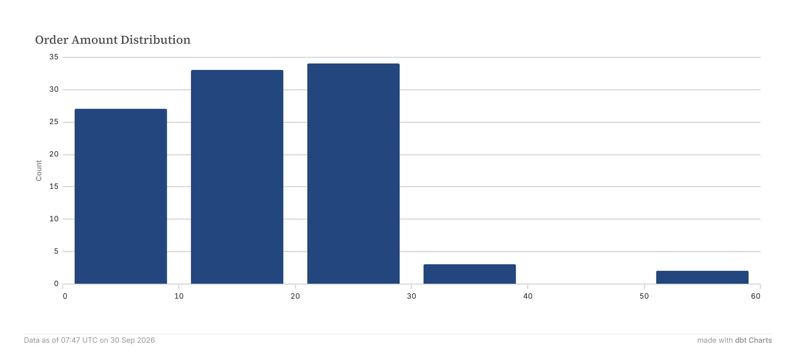

The vertical axis is titled Count. You did not ask for it. dct added it because the chart is counting rows.

That breaks the rule that aggregation belongs to the query. It is one of the few places the chart layer computes. I did not find how to set the bin width, so I am not claiming there is a way.

## KPI: one row, one number

```yaml
queries:
  order_summary:
    sql: |
      SELECT COUNT(*) AS total_orders,
             SUM(amount) AS total_revenue,
             COUNT(DISTINCT customer_id) AS total_customers
      FROM {{ ref('orders') }}
    source: jaffle

charts:
  kpi_revenue:
    query: order_summary
    type: kpi
    label: "Total revenue"
    value: total_revenue
    style:
      value:
        format: currency_whole
```

A KPI needs exactly one row. `value:` is a bare column name, never `SUM(...)`. Three tiles are three charts reading the same query and picking a different column.

Two details differ from every other chart. The header is `label:`, and `title:` is rejected. The number format lives at `style.value.format`, not `number_format`.

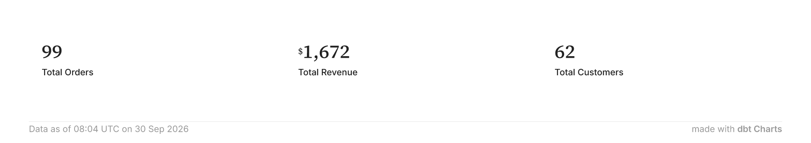

## Table: every column, in query order

```yaml
  top_customers_table:
    query: top_customers
    type: table
    title: "Top 10 customers by lifetime value"
    style:
      columns:
        customer:
          label: Customer
        number_of_orders:
          label: Orders
          align: right
        customer_lifetime_value:
          label: Lifetime value
          format: currency_whole
          align: right
```

A table shows every column the query returns, in the order it returns them. `style.columns` only styles.

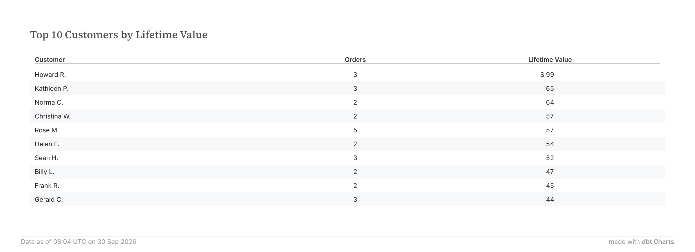

## Where it falls short

**Table currency formats.** In the table above, `format: currency_whole` puts a `$` on the first row only. Rows two to ten show a bare number. First row holds two `<tspan>`s (`$`, `99`), and every other cell holds one (`65`, `64`, `57`). The same alias works on every point in a bar or scatter. I have not tested other aliases, trailing symbols, or `kpi` and `spark_bar`.

dct cannot draw: funnel, gauge, waterfall, sankey, treemap and more.

## Next

The board at the top of this post holds all nine chart types, thirteen charts in total, on one page. This post has built the charts and left out how they got there. That is the next one: how to organise a board, and how rows, cols, grid and tabs each lay charts out. The board from this post is in [the repo](https://github.com/imagineazhar/dbt-charts-learning), tagged `p2`.
